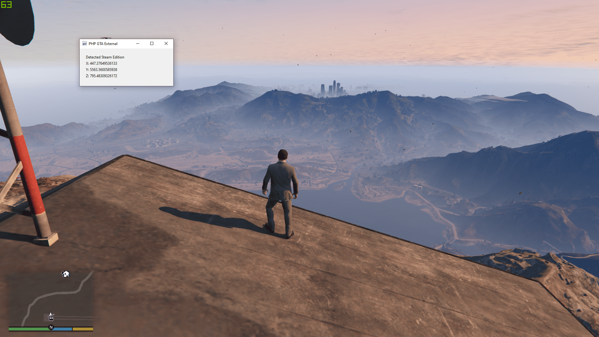

# PHP GTA External

A proof-of-concept external trainer/mod menu for GTA V written in PHP using FFI to interface with a custom C++ DLL.

## Using it

### The easy way

1. Download `PHP-GTA-External.zip` from [the latest release](https://github.com/Sainan/PHP-GTA-External/releases).
2. Extract the zip.
3. Double-click `start.bat`.

### The masochist way

1. Ensure that you have PHP >= 7.4 installed.
2. Clone this repo.
3. Compile `src/cpp_api.cpp` to create a `bin/cpp_api.dll`. If you have MinGW-W64, you can use `compile-dll-with-g++.bat`.
4. `composer install`.
5. Double-click `start.bat`.

## Screenshot

