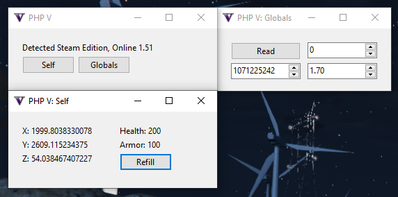

# PHP V

A proof-of-concept external mod menu for GTA V written in PHP using [FFI](https://github.com/dstogov/php-ffi) (via [PWH](https://github.com/Sainan/php-windows-hacking)) and [php-gui](https://github.com/gabrielrcouto/php-gui).

## Using it

### The easy way

1. Download `PHP-V.zip` from [the latest release](https://github.com/Sainan/PHP-V/releases).
2. Extract the zip.
3. Double-click `start.bat`.

### The manual way

If you have:

- PHP-CLI 7.4.x with the FFI extension enabled
- [Composer](https://getcomposer.org/)

Feel free to clone this repo, run `composer install` in the clone's directory, and if that worked fine, you can just execute `php run.php`.
